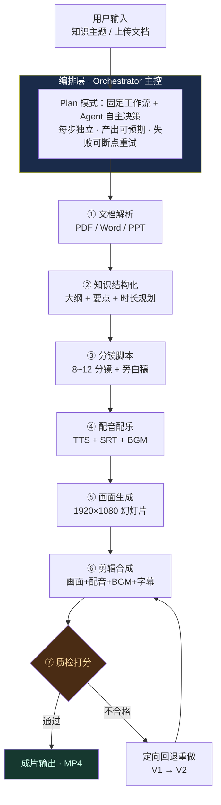

# 妙课生花 WonderKourse

> **让创意开成一堂课**
> 输入知识主题 / 文档 → Agent 自主完成脚本、配音、画面、字幕、剪辑、导出成片，全程人工零干预。

一句话概括：**你只写一个知识点，剩下的七步交给 Agent。**

---

## 一、先看效果

| 输入 | 输出 |
|---|---|
| 「翻转课堂」选「约 3 分钟」 | 9 个分镜 / **2 分 41 秒** / 1080P MP4 / 配音 + 背景音乐 + 中文字幕 |
| 「布鲁姆认知目标六层级」选「约 3 分钟」 | 9 个分镜 / **2 分 40 秒** / 自动质检 100 分 |
| 一份《翻转课堂说明》Word/PDF | 旁白直接依据文档要点，关键词从文档中提炼 |
| 同上，选「竖版 9:16」 | 1080×1920 竖屏成片，适合发到手机端 |

产出物全部保存在 `output/<项目号>/` 下，可下载 MP4 直接用于课堂、教研分享或线上发布。

### 三个可选的进阶能力

- **目标时长**：2 / 3 / 4 / 6 / 8 分钟，**选多少就真的出多少**。
  实现方式是「预算制」：目标时长 ÷ 分镜数 = 每镜旁白应有的字数，再把字数区间
  作为硬性要求交给脚本层；分镜数会随目标时长在 8~12 之间浮动（短课少镜、长课多镜）。
  最后还有一道兑底校准：若某个镜头写超了，按句边界裁短最长的那一镜。
  自检命令：`.venv\Scripts\python.exe tools\check_duration.py`。
- **画面比例**：横版 16:9（电脑/投影/B 站）与竖版 9:16（手机端）随时切换。
  竖版不是简单裁一刀 —— 横向排列的流程、对比会自动改成纵向堆叠，字幕字号与底部
  边距也会重算（避开手机端 UI 遮挡）。
- **每屏配图**：**每一屏都自动配一张结构化插图**，不再是只有个别版式才有图。
  按分镜语义自动选图型：引语页用**聚焦徽章**、要点页用**索引轨道**、要素页用**概念结构图**、
  机制页用**流程链**、场景页用**标签云**、误区页用**对照板**、回顾页用**总览环图**，
  封面/片尾用**抽象主视觉**；也可以一键关掉，退回纯文字版式。
  插图是本机用代码绘制的矢量图形，不联网、不花钱、内容准确（AI 生图很容易把文字画错）。

> 关于「目标时长」的一个已知边界：内置脚本引擎的知识库每个主题约 30 条要点，
> 素材量上限约 5 分钟。如果你选了 6/8 分钟而没配大模型，系统会在日志里
> 如实告诉你「素材已讲满」，并提示你配 Key 或上传更详细的文档，而不是拿空话凑时长。

---

## 二、三步跑起来

### 方式 A：一键启动（Windows，推荐）

双击项目根目录下的 **`start.bat`** 即可 —— 它会自动建虚拟环境、装依赖、启动服务并打开浏览器。

### 方式 B：手动三步（VS Code 终端）

```powershell
# ① 用 VS Code 打开本项目文件夹（ai-micro-lecture-pro）
# ② 安装依赖（首次约 1~3 分钟）
python -m venv .venv
.\.venv\Scripts\python.exe -m pip install -r requirements.txt

# ③ 启动
.\.venv\Scripts\python.exe app.py
```

浏览器打开 **http://127.0.0.1:8000** 即可使用。

> macOS / Linux：执行 `bash start.sh`。

### 先做个环境自检（可选，推荐）

```powershell
.\.venv\Scripts\python.exe check_env.py
```

会逐项检查 FFmpeg、中文字幕滤镜、中文字体、语音合成引擎、文档解析依赖，
并给出「能不能跑通」的明确结论。

---

## 三、核心流程：七步全自动



**关键点**：质检回退是**定向修复**，不是整条重跑 ——
哪一环被判不合格就只重做哪一环（省时间、也省 Token，如果接了大模型的话）。

---

## 四、七个 Agent 各干什么

| # | Agent | 职责 | 用到的工具 |
|---|---|---|---|
| ① | `DocumentParserAgent` | 提取 PDF / Word / PPT / TXT 的正文与结构 | pdfplumber · python-docx · python-pptx |
| ② | `StructureAgent` | 生成教学大纲、拆解知识要点、规划分镜与时长 | 大模型（可选）/ 内置学科知识骨架 |
| ③ | `ScriptAgent` | 为每个分镜撰写口语化旁白稿与画面指令 | 大模型（可选）/ 内置教学脚本引擎 |
| ④ | `AudioAgent` | 逐镜配音、生成 SRT/ASS 字幕时间轴、合成背景音乐 | edge-tts → Windows SAPI → 静音（三级降级） |
| ⑤ | `VisualAgent` | 按版式渲染幻灯片 + 生成结构化插图 | **Pillow 直接绘制**（不需要 LibreOffice） |
| ⑥ | `EditAgent` | 画面 + 配音 + BGM + 字幕烧录 → MP4 | **FFmpeg**（由 imageio-ffmpeg 自带） |
| ⑦ | `ReviewAgent` | 8 项质检打分，不合格自动回退重做 | 反思模式质检闭环 |

每个 Agent 都以 **思考 → 行动 → 观察** 三段式汇报，日志在网页右侧实时滚动，
不是黑盒进度条。

### 画面版式一览

| 版式 | 用在哪 | 配图 |
|---|---|---|
| `cover` | 片头 | 主题胶囊 + 大标题 + 抽象主视觉 |
| `quote` | 问题引入 / 概念界定 | 引语大字 **+ 右侧聚焦徽章** |
| `points` | 为什么重要 | 编号要点卡片 **+ 右侧索引轨道** |
| `board` | 核心要素 / 运作机制 / 应用场景 / 案例 | 左侧要点 **+ 右侧插图**（概念图/流程链/标签云）|
| `steps` | 实践建议 | 横版：编号卡片+箭头（原生图形）+ 装饰层；竖版：纵向流程链 |
| `compare` | 常见误区 | 横版：双栏对照（原生图形）+ 装饰层；竖版：上下对照板 |
| `summary` | 要点回顾 | 编号回顾列表 **+ 右侧总览环图** |
| `ending` | 片尾 | 谢谢观看 + 核心要点 + 抽象主视觉 |

插图类型由分镜语义自动决定：`concept`概念结构图 / `flow`流程链 /
`tags`标签云 / `compare`对照板 / `rail`索引轨道 / `radial`总览环图 /
`spotlight`聚焦徽章 / `motif`抽象主视觉。

> 设计上只有一条原则：**右侧图形不能把左侧文字再拄一遍**。
> 所以引语页只放符号不放文字、回顾页只画结构不列条目，左边给完整信息、右边给结构。

> 想直接看板式效果，不用跑完整视频：
> `.venv\Scripts\python.exe tools\preview_frames.py --fmt portrait`
> 会把全部版式渲染到 `output/_preview/` 供你快速检查。

---

## 五、两种创作模式

| | 主题驱动模式 | 文档精讲模式 |
|---|---|---|
| 输入 | 一句话知识主题 | 上传 PDF / Word / PPT / 教案 |
| 生成方式 | 命中「学科知识骨架库」→ 用精编内容；未命中 → 通用教学叙事骨架 + 领域词库扩写 | 提炼关键词与关键句，按教学逻辑重组 |
| 适合 | 概念讲解、原理科普、教学微课 | 把现有教案、论文、课件一键变成微课 |

**没有任何 API Key 也能完整使用** —— 内置教学脚本引擎会如实标注当前生成方式，
不会把规则引擎伪装成大模型。配置 Key 后自动升级为大模型生成。

---

## 六、界面说明

### 首页
- 顶部一句话即可开始制作（输入主题 → 直接跳创作台）
- 两种创作模式卡片
- **端到端系统架构图**：用户输入 → 编排层 → 执行层（7 Agent）→ 成片输出，含图例
- 最近作品（点击直接回放）

### 创作台（三栏）
```
┌──────────┬──────────────────────────┬──────────────────┐
│ 历史项目 │ 预览区                    │ Agent 控制台      │
│          │  工具栏：字幕/全屏/导出   │  知识主题输入      │
│ 点击回放 │  视频播放器               │  文档上传          │
│          │  成片信息条               │  时长/配色/风格    │
│          │  分镜时间轴（点击跳转）   │  执行流水线状态    │
│          │  质检报告（逐项打勾）     │  实时 Agent 日志   │
└──────────┴──────────────────────────┴──────────────────┘
```

### 少量干预点（对应设计图里的「预览 & 修改后再导出」）
- **字幕开关**：成片同时生成「带字幕版」和「无字幕版」，切换即时生效
- **点分镜卡片**：跳转到对应时间点回放
- **✎ 修改后重做**：可改任意一镜的旁白稿、可换画面配色 → Agent 只重跑受影响的环节
  （改文案只重做该镜的配音与字幕；换配色只重渲染画面），最后重新剪辑并再次质检
- **⚙ 大模型设置**：在页面里填 API Key / 接口地址 / 模型名，保存即生效，无需改代码

### 创作台可选项

| 选项 | 取值 |
|---|---|
| 目标时长 | 2 / 3 / 4 / 6 / 8 分钟 |
| 画面比例 | 横版 16:9 / 竖版 9:16 |
| 画面配色 | 深海蓝 / 书院青 / 晨光橙 |
| 插图 | 自动生成插图 / 纯文字版式 |
| 面向对象 | 本科生 / 高职学生 / 教师培训……（自由填写） |
| 背景音乐 | 舒缓 / 明快 / 温暖 |

---

## 七、目录结构

```
ai-micro-lecture-pro/
├── app.py                    # FastAPI 后端（页面 + API + 事件流 + 定向重做）
├── check_env.py              # 环境自检脚本
├── start.bat / start.sh      # 一键启动
├── requirements.txt
├── .env.example              # 可选配置模板（复制为 .env 生效）
├── Dockerfile                # 公网部署镜像（内置中文字体）
├── render.yaml               # Render 一键部署蓝图
├── DEPLOY.md                 # 公网部署说明
│
├── agent/                    # 核心：编排层与 7 个 Agent
│   ├── orchestrator.py       #   主控状态机 + 质检反思闭环
│   ├── agents.py             #   7 个 Agent 的实现
│   ├── knowledge.py          #   内置教学脚本引擎（无 Key 也能出内容）
│   ├── llm_client.py         #   大模型客户端（OpenAI 兼容接口）
│   ├── slides.py             #   画面渲染层（横/竖版自适应，含图文混排版式）
│   ├── illustrate.py         #   插图绘制层（概念图/流程链/标签云/对照板）
│   ├── textkit.py            #   中文字体与折行工具
│   ├── music.py              #   背景音乐合成（numpy）
│   ├── media.py              #   FFmpeg / TTS / 时长探测基础层
│   └── config.py             #   全局配置（含画面比例定义）
│
├── static/                   # 前端（原生 HTML/CSS/JS，零构建）
│   ├── index.html / guide.html / create.html
│   ├── css/style.css
│   ├── logo.svg
│   └── js/index.js / create.js / ui.js
│
├── tools/                    # 辅助工具
│   ├── make_video.py         #   命令行直接出片
│   ├── preview_frames.py     #   版式预览（秒出图，不用跑视频）
│   ├── test_llm_offline.py   #   用本地假接口验证大模型通路（无需 Key）
│   ├── api_test.py           #   接口全链路冒烟测试
│   └── probe_subtitles.py    #   中文字幕烧录诊断
│
└── output/                   # 每个项目的全部产物
    └── 20260910-113417-ADDIE-教学设计模型/
        ├── plan.json         #   脚本与分镜方案
        ├── project.json      #   项目元信息与质检报告
        ├── slides.pptx?      #   （无：本方案不用 PPT 中转）
        ├── frames/           #   逐镜画面 PNG（1080P）
        ├── shots/            #   逐镜配音 MP3
        ├── clips/            #   逐镜视频片段
        ├── bgm.wav           #   自动合成的背景音乐
        ├── narration.srt     #   字幕（通用格式，供下载）
        ├── narration.ass     #   硬字幕源（自带画布尺寸，字号=真实像素）
        ├── final.mp4         #   ✅ 带字幕成片
        └── final_nosub.mp4   #   ✅ 无字幕成片
```

---

## 八、可选：接入大模型（会明显提升脚本质量）

**最简方式：直接在网页里填。**
打开创作台 → 右上角 **⚙ 大模型设置** → 填入 API Key，保存即生效（写入本机 `.env`，
不会上传到任何服务器）。

也可以手动复制 `.env.example` 为 `.env`：

```ini
LLM_API_KEY=sk-xxxxxxxxxxxxxxxx
LLM_BASE_URL=https://api.deepseek.com/v1
LLM_MODEL=deepseek-chat
```

也支持通义千问、智谱 GLM、Kimi、本地 Ollama 等，模板里都有例子。
填写后网页右上角会显示「大模型模式」。

**接入后具体多了什么？**

| 环节 | 无 Key | 配置 Key 后 |
|---|---|---|
| ② 知识结构化（讲什么） | 内置 6 个精编骨架 + 通用叙事骨架 + 文档提炼 | 大模型生成教学要点 |
| ③ 分镜脚本（怎么讲） | 规则引擎逐镜写旁白 | 大模型逐镜撰写旁白稿 |

**没 Key 也想验证通路？** 用本地假接口跑一遍：

```powershell
.venv\Scripts\python.exe tools\test_llm_offline.py
```

它会在本机起一个模拟的 OpenAI 兼容接口，把「请求组装 → 返回解析 → JSON 提取 →
分镜装配」整条链路跑一遍并逐项断言，不需要真正的 Key、也不联网。

---

## 九、命令行出片（不打开网页也能用）

```powershell
# 主题驱动（横版）
.venv\Scripts\python.exe tools\make_video.py "翻转课堂" --minutes 3

# 竖版短视频（手机端）
.venv\Scripts\python.exe tools\make_video.py "布鲁姆教育目标分类学" --fmt portrait

# 文档驱动 + 换配色 + 关掉插图
.venv\Scripts\python.exe tools\make_video.py "课程思政" `
    --file "D:\讲义.pdf" --theme scholar --no-illustrations
```

---

## 十、常见问题

**Q：需要安装 FFmpeg 或 LibreOffice 吗？**
不需要。FFmpeg 由 `imageio-ffmpeg` 这个 pip 包自带二进制；
画面用 Pillow 直接绘制，完全不需要 LibreOffice / PowerPoint。
这是本项目在 Windows 上「开箱即跑」的关键。

**Q：配音需要联网吗？**
`edge-tts` 在线合成音质最好，需要联网。
断网时会自动降级到 Windows 内置中文语音（离线）；再不行会退化为静音但视频仍能生成。

**Q：视频没有声音 / 字幕是方块？**
运行 `check_env.py` 检查。字幕繁体生僻字若缺字形可改 `SUBTITLE_FONT_NAME`。

**Q：能改配音音色吗？**
改 `.env` 里的 `TTS_VOICE`，可选 `zh-CN-XiaoxiaoNeural`（女声）、
`zh-CN-YunyangNeural`（新闻男声）、`zh-CN-XiaoyiNeural`（年轻女声）等。

**Q：想演示「质检自动重做」怎么办？**
项目里已内置反思闭环。可临时调低 `agent/config.py` 中的相关阈值，
或在 `agents.py` 的 `ReviewAgent` 里加一条更严格的检查，即可在日志中看到
「V1 → V2」的定向回退过程。

**Q：竖版视频和横版是同一套内容吗？**
是。同一份分镜脚本，版式会自动适配：横版双栏的内容在竖版会变成纵向堆叠，
插图位置从右侧改为上方，字幕字号与底部边距也会重算。

**Q：插图会不会画错内容？**
插图里的文字全部来自你自己的脚本要点，图形是按“关系/流程/分类/对照”的模板
程序化绘制的，不会像文生图那样编造内容或把汉字画错。

---

## 十一、技术选型说明（答辩可用）

| 决策 | 备选方案 | 为什么这么选 |
|---|---|---|
| 画面：Pillow 直接绘制 | python-pptx + LibreOffice 转图片 | 后者在 Windows 要额外装 LibreOffice 与 poppler，还会踩中文字体坑；前者零依赖、版式可控、出图更快 |
| 视频：imageio-ffmpeg | 让用户自己装 FFmpeg | pip 安装即可，不需要管理员权限，学生电脑上也能一键跑通 |
| 字幕：自建 ASS（显式 PlayRes） | 直接用 SRT + force_style | SRT 不给画布尺寸，libass 会按默认 288 高坐标空间缩放，1080P 下字幕会被放大到画面中部；自建 ASS 在文件头声明 PlayRes=视频分辨率，FontSize/MarginV 就是真实像素 |
| 插图：本机程序化绘制 | 文生图 API | 微课插图要的是「关系/流程/分类」这类结构图形，矢量绘制更准确；且不联网、不花钱、不挑显卡（文生图接口仍作为可选项保留） |
| 前端：原生 HTML/CSS/JS | React / Vue + 构建工具 | 作业场景下降低环境门槛，打开即用，不需要 npm |

---

## 十二、对照课程要求逐条检查

| # | 要求 | 实现情况 |
|---|---|---|
| 1 | 网站能输入知识主题 / 文档 / PPT | ✅ 首页与创作台均可输入主题；支持上传 PDF / Word / PPT / TXT |
| 2 | Agent 自主完成脚本 | ✅ ③ ScriptAgent，可打印旁白稿全文 |
| 3 | 自主完成配音 | ✅ ④ AudioAgent，edge-tts 在线配音 + 三级降级 |
| 4 | 自主完成画面 | ✅ ⑤ VisualAgent，7 种版式自动排布 |
| 5 | 自主完成字幕 | ✅ ④ 生成 SRT 时间轴，⑥ 烧录为硬字幕，另存无字幕版 |
| 6 | 自主完成剪辑 | ✅ ⑥ EditAgent，逐镜合成 + 拼接 + BGM 混音 + 字幕 |
| 7 | 导出成片 | ✅ 页面内预览 + 一键导出 MP4 + 下载 SRT |
| 8 | 全程人工零干预 / 少量干预 | ✅ 默认零干预；提供「✎ 修改后重做」作为少量干预点 |
| 附 | 多 Agent 协同 + Plan 模式 + 反思质检 | ✅ 7 Agent 分工、Orchestrator 固定工作流、ReviewAgent 质检回退 |
| 附 | 适配手机端的竖版短视频 | ✅ 一键切竖版 9:16，版式与字幕自动重排 |
| 附 | 画面插图（不只文字版式） | ✅ 概念结构图 / 流程链 / 标签云 / 对照板自动生成 |
| 附 | 接入大模型提升脚本质量 | ✅ 网页内可直接填 Key，也支持 .env 配置，失败自动降级 |

---

## 十三、界面截图位置

生成后可在浏览器直接查看；如需截图放进报告，建议截：
1. 首页首屏（主标题 + 快捷主题 + 输入框）
2. 创作台三栏全貌（含右侧 7 步流水线与日志）
3. 质检报告卡片（8 项全绿）
4. 成片播放中的一帧（含中文硬字幕）

---

## 十四、部署到公网（让别人也能打开链接用）

先说结论：**这个项目不能放 GitHub Pages**。它不是静态网页，
需要 Python + FFmpeg 在服务器上真的跑起来才能出片；
GitHub Pages 只能托管 HTML/CSS/JS，放上去打开只会显示「服务未连接」。

正确做法是「GitHub 存代码 + 云平台跑容器」：

```
GitHub 仓库  →  云平台拉取并构建 Docker 镜像  →  给你一个可访问的网址
```

仓库里已经备好两样东西，不用写运维配置：

| 文件 | 作用 |
|---|---|
| `Dockerfile` | 基于 python:3.12-slim，**内置 Noto CJK 中文字体**（不装的话画面与字幕中文会变方块） |
| `render.yaml` | Render 一键部署蓝图，包含所需环境变量清单 |

**三步上线**：把仓库推到 GitHub → Render 里选 Blueprint 选中仓库 →
在面板上填 `LLM_API_KEY` 与 `ACCESS_PASSWORD`。

### 上线前必须知道的一件事

不设 `ACCESS_PASSWORD` 的话，**任何拿到网址的人都能点「开始制作」**，
消耗你的服务器 CPU 与 DeepSeek 额度。设了之后走 HTTP Basic 认证，
浏览器会弹原生登录框，不用额外写登录页。

同时，线上会**默认禁止**网页端「⚙ 大模型设置」写配置：
它会把 Key 写进服务器的 `.env`，否则访客只要把接口地址改成自己的
服务器，就能把你真实的 Key 接走。

➡️ **完整部署步骤、免费档的坑、故障排查：见 [DEPLOY.md](DEPLOY.md)**

---

祝演示顺利 🎬
